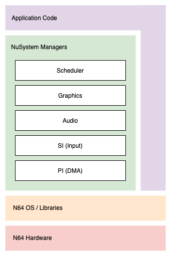
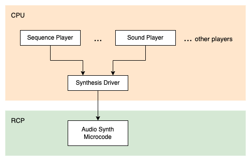

# Notes

Summary of useful information from various sources, including the N64 SDK manual, hardware docs, etc.

## Contents

* [Overview](#overview)
* [Memory](#git)
* [RCP Architecture](#rcp-architecture)
* [Microcode](#microcode)
* [Audio](#audio)
* [Caches](#caches)
* [N64 OS](#n64-os)
* [NuSystem](#nusystem)
* [NuSystem Audio](#nusystem-audio)
* [RSPBOOT](#rspboot)

## Overview

The Nintendo 64 is built around two main processors. The main CPU is a MIPS R4300i, clocked at 93.75 MHz. This is a standard 64-bit CPU.

This is complemented by the RCP, or Reality Coprocessor. The RCP consists of two main cores. One is the Reality Signal Processor, or RSP, which is based on a MIPS 4000 design and clocked at 62.5 MHz. The other is the Reality Display Processor, or RDP. While the RSP is primarily used for vector processing and audio, the RDP is responsible for rasterisation.

The RCP is also used to handle joystick/controller inputs, and provides a DMA controller for memory access.

## Memory

The console has 4.5 MB of RAM, 512 KB of which is reserved for use by the RCP. The kind of memory used is Rambus DRAM - high bandwidth, making it appropriate for graphics, but also high latency. Memory is connected directly to the RCP.
 
While the RCP can access memory directly, the CPU does not have its own DMA controller. This means that CPU memory access facilitated by the RCP.

Memory is expandable by a further 4 MB, using an Expansion Pak. The additional memory is connected to the CPU. Does this increase memory for RCP as well? How does this relate to normal DMA operations?

## RCP Architecture

Internal bus provides up to 1 GB/s bandwidth. The RCP is connected to system memory via a 562.5 MB/s bus.

At a high level, the RSP is a programmable vector processor. Operations such as transform & lighting (T & L) are implemented via microcode, and code running on the CPU is responsible for preparing 'display lists' that invoke microcode. Microcode can be changed or swapped out at runtime.

Games typically used microcode provided by Nintendo, but later in the console`s lifetime, some innovative game studios developed their own, in pursuit of higher performance and enhanced graphics.

RDP handles z-buffering and pixel rasterisation.

## Microcode

The microcode provided by Nintendo is called Fast3D, and can be used to draw up to 100,000 polygons per second (triangles?). This works out to be ~1,666 per frame at 60 FPS, or ~3333 per frame at 30 FPS.

An alternative called Turbo3D was provided, which was up to 5 times faster, at the expense of image quality.

Aside: Many Nintendo 64 emulators do not directly simulate the RSP and instead implement Nintendo`s microcode using faster 3D APIs. This means that while you can write your own microcode, in practice, it will probably not work on an emulator that is fast enough to be playable.

Microcode is stored in IMEM, which is 4KB in size. Microcode nstructions are 4 bytes each, therefore there is a limit of 1024 microcode instructions that can be loaded in the RSP at any given time.

Microcode also has access to DMEM (or data memory), which is used for display lists, etc.

### Microcode Variants

There are three ways that rasterisation commands can be sent from the RSP to the RDP:
1. FIFO: A queue in RDRAM
2. XBUS: direct communication between the RSP & RDP
3. DRAM: Like FIFO, but this relies on the CPU to facilitate communication between the two cores. **TODO: Why would this be useful?**

### Display Lists

One of the challenges of Nintendo 64 development is that the CPU is required to prepare `display lists` that are forwarded to the RCP as tasks. These tasks can then be run concurrently, while the CPU prepares the next display list, and performs other operations.

## Audio

On the Nintendo 64, audio synthesis is also handled by the RSP using dedicated microcode.

## Caches

Two 64-bit caches. One 16 KB instruction cache, and another 8 KB data cache.

There is an additional 256 KB cache shared by the CPU and RCP.

## N64 OS

Basic operating system and support libraries. All console functionality is exposed via these APIs, however they are very low level and difficult to program.

## NuSystem

NuSystem is a C Library used by the Nintendo 64 that provides applications with an alternative way of communicating with the N64 OS, and subsequently the hardware.

## NuSystem Audio

As mentioned earlier, audio synthesis is also handled by the RSP using dedicated microcode. This is made available to the programmer via players, i.e. Sequence Players and Sound Players, that are both clients of a Synthesis Driver. The Synthesis Driver is responsible for creating RSP command lists that invoke audio microcode.

Sequence Players can be used to play MIDI audio, or an alternative compressed format. They provide features such as sequencing, instrument banks, and scheduling.

Sound Players support ADPCM compressed audio (limited to mono), or 16-bit uncompressed audio.

### Audio Architecture

At a high level, this can be visualised as in the following diagram:

Sampled sounds are typically represented using a structure called `ALSound`. This contains values for `envelope`, `pan` and `volume`, as well as a pointer to an ALWaveTable. While playing, a sample will be in one of three envelope states: Attack, Delay, or Release.

The duration of a sound is the minimum of the envelope, or the length of the wavetable entry, scaled by pitch.

Sounds may be looped or un-looped.

### General process for handling audio

1. Create and initialise resources (e.g. audio heap, synthesiser, and a player)
    1. Call `alHeapInit` to create audio heap
    2. Call `osAiSetFrequency` to set hardware output frequency
    3. Call `alInit` to create synthesiser
    4. Setup message queue
    5. Create and init players
2. Repeatedly call `alAudioFrame` to generate audio task lists
    1. Execute audio task lists on RSP
    2. Set output DAC to point to the audio output using `osAiSetNextBuffer`

Once audio has been initialised, outputting audio is a process of:
1. Use repeated calls to `alAudioFrame` to generate audio task lists
2. Execute audio task lists on RSP
3. Use `osAiSetNextBuffer` to set output DAC to point to the audio output

### SoundPlayer Overview

1. Setup basic sound/audio resources, using `allnit`, etc.
2. Call `alSndpNew` to create a new SoundPlayer (this effectively 'signs in' as a client to the synthesis driver
3. Initialise sound bank using `alBnkfNew`
4. Load sound bank .ctl file into RAM
5. Allocate a sound using `alSndpAllocate`. This will later be freed using `alSndpDeallocator`
6. Set target sound using `alSndPSetSound`.
7. Play sound using `alSndpPlay`, then stop the sound using `alSndpStop`

## RSPBOOT

ROMs must be linked with the code necessary to initialise the RSP. It is responsible for setting registers, parsing a task header, loading additional microcode from main memory.

Generally speaking, this will be found in an object called `rspboot.o`, which is part of the Nintendo 64 SDK.

In debug builds, this is 740 bytes, but is reduced to 208 bytes in release builds. It will be loaded into IMEM at the beginning of each OsTask (i.e. via `osSpTaskLoad`).
